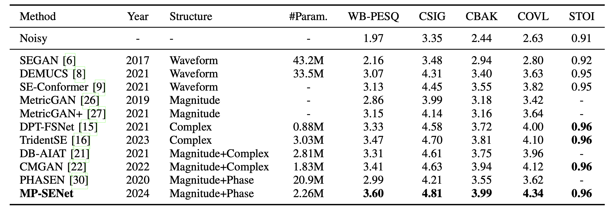

# Explicit Estimation of Magnitude and Phase Spectra in Parallel for High-Quality Speech Enhancement
### Ye-Xin Lu, Yang Ai, Zhen-Hua Ling
In our [paper](https://arxiv.org/abs/2305.13686), we proposed MP-SENet: a TF-domain monaural SE model with parallel magnitude and phase spectra denoising.<br>
A [long-version](https://arxiv.org/abs/2308.08926) MP-SENet was extended to the speech denoising, dereverberation, and bandwidth extension tasks.<br>
Audio samples can be found at the [demo website](http://yxlu-0102.github.io/MP-SENet).<br>
We provide our implementation as open source in this repository.

**Abstract:** 
Phase information has a significant impact on speech perceptual quality and intelligibility.
However, existing speech enhancement methods encounter limitations in explicit phase estimation due to the non-structural nature and wrapping characteristics of the phase, leading to a bottleneck in enhanced speech quality.
To overcome the above issue, in this paper, we proposed MP-SENet, a novel Speech Enhancement Network that explicitly enhances Magnitude and Phase spectra in parallel.
The proposed MP-SENet comprises a Transformer-embedded encoder-decoder architecture.
The encoder aims to encode the input distorted magnitude and phase spectra into time-frequency representations, which are further fed into time-frequency Transformers for alternatively capturing time and frequency dependencies.
The decoder comprises a magnitude mask decoder and a phase decoder, directly enhancing magnitude and wrapped phase spectra by incorporating a magnitude masking architecture and a phase parallel estimation architecture, respectively. 
Multi-level loss functions explicitly defined on the magnitude spectra, wrapped phase spectra, and short-time complex spectra are adopted to jointly train the MP-SENet model. 
A metric discriminator is further employed to compensate for the incomplete correlation between these losses and human auditory perception.
Experimental results demonstrate that our proposed MP-SENet achieves state-of-the-art performance across multiple speech enhancement tasks, including speech denoising, dereverberation, and bandwidth extension.
Compared to existing phase-aware speech enhancement methods, it further mitigates the compensation effect between the magnitude and phase by explicit phase estimation, elevating the perceptual quality of enhanced speech.
Remarkably, for the speech denoising task, the proposed MP-SENet yields a PESQ of **3.60** on the VoiceBank+DEMAND dataset and **3.62** on the DNS challenge dataset.

## Pre-requisites
1. Python >= 3.6.
2. Clone this repository.
3. Install python requirements. Please refer [requirements.txt](https://github.com/yxlu-0102/MP-SENet/blob/main/requirements.txt).
4. Download and extract the [VoiceBank+DEMAND dataset](https://datashare.ed.ac.uk/handle/10283/1942). Resample all wav files to 16kHz, and move the clean and noisy wavs to `VoiceBank+DEMAND/wavs_clean` and `VoiceBank+DEMAND/wavs_noisy`, respectively. You can also directly download the downsampled 16kHz dataset [here](https://drive.google.com/drive/folders/19I_thf6F396y5gZxLTxYIojZXC0Ywm8l).

## Training
```
CUDA_VISIBLE_DEVICES=0,1 python train.py --config config.json
```
Checkpoints and copy of the configuration file are saved in the `cp_mpsenet` directory by default.<br>
You can change the path by adding `--checkpoint_path` option.

## Inference
```
python inference.py --checkpoint_file [generator checkpoint file path]
```
You can also use the pretrained best checkpoint files we provide in the `best_ckpt` directory.
<br>
Generated wav files are saved in `generated_files` by default.
You can change the path by adding `--output_dir` option.<br>
Here is an example:
```
python inference.py --checkpoint_file best_ckpt/g_best_vb --output_dir generated_files/MP-SENet_VB
```

## Model Structure


## Comparison with other SE models


## Acknowledgements
We referred to [HiFiGAN](https://github.com/jik876/hifi-gan), [NSPP](https://github.com/YangAi520/NSPP) 
and [CMGAN](https://github.com/ruizhecao96/CMGAN) to implement this.

## Citation
```
@inproceedings{lu2023mp,
  title={{MP-SENet}: A Speech Enhancement Model with Parallel Denoising of Magnitude and Phase Spectra},
  author={Lu, Ye-Xin and Ai, Yang and Ling, Zhen-Hua},
  booktitle={Proc. Interspeech},
  pages={3834--3838},
  year={2023}
}

@article{lu2023explicit,
  title={Explicit estimation of magnitude and phase spectra in parallel for high-quality speech enhancement},
  author={Lu, Ye-Xin and Ai, Yang and Ling, Zhen-Hua},
  journal={arXiv preprint arXiv:2308.08926},
  year={2023}
}
```
